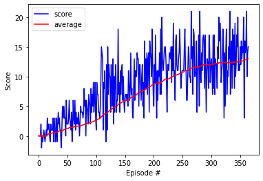
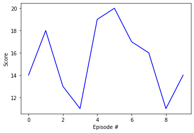
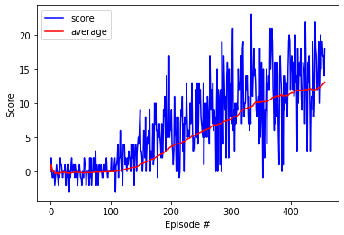

# Report

## 


### Abstract
We report on the project for the banana navigation solved by utilizing the deep reinforcement learning with the Deep Q-networks (DQNs).

### Prerequisites
For prerequisites, it may be instructive to refer to [DQN paper](https://storage.googleapis.com/deepmind-media/dqn/DQNNaturePaper.pdf). 

## Set-up

In a large square field, one agent moves around while collecting bananas. 
There are four actions selected by the agent based on $\epsilon$-greedy policy at each time step:
- `0` - walk forward 
- `1` - walk backward
- `2` - turn left
- `3` - turn right
 
The state space has `37` dimensions and contains the agent's velocity, along with ray-based perception of objects around agent's forward direction. When the agent collects bananas, a yellow banana corresponds to a reward of `+1` whilst a blue one to `-1`. 

## Goal
Our goal for this episodic taks is for the agent to achieve an average score of `+13` over `100` consecutive episodes. 

## Our learning algorithm
Here we make a summary of important components in our algorithm.

### - DQN
In this project of our interest, we focus on the applications of reinforcement learning. The latter is based on the interaction between the agent and the environment. Given a state (or a so-called observation) given by the environment, the agent takes a certain action based on a policy, so that some reward is then returned. Given a state, The agent is trained in such a way that the total amount of reward is maximized. 

Deep reinforcement learning computes an expected return, or a action-state value (Q-function), taking advantage of the deep neural network. The latter plays a role in `non-linear function` approximators. So the algorithm of the Deep Q-Learning (DQN) represents an optimal action-value `function` (not a `table`) as a neural network. Through the iterative training process, the weights in such a neural network are updated.

Our DQN consists of three fully connected layers. The first two hidden layers are accompanied by the Relu activation function. The last linear layer leads to an action vector. 

### - Experiance replay
In general, reinforcement learning is unstable when neural networks are introduced to exploited the action value functions. To stabilize the learning, one shall add some helpful tweaks to the DQN. Our network has a replay buffer. It acts as a memory pool, where the experiences of the past are stored and randomly sampled (Experience replay). Therefore, noisy fluctuations are avoided. 

### - Fixed Q-Targets
Besides, in our algorithm, there are so-called local and target networks. Both networks have the identical structure but different weights. We keep the weights of the target network fixed during the training, which deals with harmful correlations from the simultaneous update of the Q-functions. 

### - Other tweaks
Moreover, we can apply two optional functions to the agent for improvement. First, we can extend to the [double Q-learning](https://arxiv.org/abs/1509.06461), so that we can reduce the overestimation of Q-values arising from the lack of exploration in early states. The second option is to enhance to the [dueling network architecture](https://arxiv.org/abs/1511.06581). The latter has a branch off structure of linear layers and thus leads to the sum of advantages values and state values. In general, we aim to capture of both aspects of Q-values which do and do not vary with respect to the actions.

## Result
Here we begin with a list of concrete values for hyperparameters in the algorithm and present the results of training and test processes.
### - Hyperparameters
We used the following set of hyperparameters for the agent and the training function, named `dqn`. 
Firstly, the agent has
- BUFFER_SIZE = 1e5
- BATCH_SIZE = 64
- GAMMA (discount factor) = 0.99
- TAU (used by the soft update) = 1e-3
- LR (learning rate in Adam) = 5e-4
- UPDATE_EVERY (time steps to update the network) = 4

Also, we carried out the training process by using
- \# of episodes = 500
- maximum of time steps = 1000
- initial value of $\epsilon$ = 1.0
- allowed minimum value of $\epsilon$ = 0.02
- decay rate of $\epsilon$ = 0.986

We turned `off` both the double Q-learning and the dueling network structure.

### - Training history
The environment was solved within 500 episodes and indeed only in 265 episodes. The average scores per 100 episodes are given as follows:
```
Episode 100	Average Score: 2.58
Episode 200	Average Score: 8.65
Episode 300	Average Score: 11.98
Episode 365	Average Score: 13.00
Environment solved in 265 episodes!	Average Score: 13.00
```

 The plot of the scores with the average over 100 consecutive episodes is shown below. 



### - Testing history
Using the trained model, we tested 10 episodes to see its performance. The result is given as follows:
```
Episode 1	Average Score: 14.00
Episode 2	Average Score: 16.00
Episode 3	Average Score: 15.00
Episode 4	Average Score: 14.00
Episode 5	Average Score: 15.00
Episode 6	Average Score: 15.83
Episode 7	Average Score: 16.00
Episode 8	Average Score: 16.00
Episode 9	Average Score: 15.44
Episode 10	Average Score: 15.30
```
 Nicely, the average score `>=14` was observed in each episode!



### - DDQN + Dueling 
For comparison, we trained another model with the double Q-learning as well as the dueling structure. It has been shown that the progress goes more slowly than the previous mode and more episodes are required to solve the environment. Seemingly, using both DDQN and the dueling network architecture required more episodes needed to solve the environment. The noisy fluctuation may have been reduced compared to the previous model, but it is not so obvious. For this model, we will not pursue more details here.

```
Episode 1	Average Score: 14.00
Episode 2	Average Score: 16.00
Episode 3	Average Score: 15.00
Episode 4	Average Score: 14.00
Episode 5	Average Score: 15.00
Episode 6	Average Score: 15.83
Episode 7	Average Score: 16.00
Episode 8	Average Score: 16.00
Episode 9	Average Score: 15.44
Episode 10	Average Score: 15.30
```



## Outlook
In general, reinforcement learning is very sensitive to hyperparameters. Thus, we need to carefully tweak hyperparameters for a better model building listed above. Moreover, we need to combine useful options to stabilize the performance, such as DDQN and dueling network architectures. It would be interesting to consider more additional tweaks to improve the stability and a better performance of the algorithm. For example, it would be fascinating to improve the algorithm according to [Rainbow](https://arxiv.org/abs/1710.02298), where various improvements, such as [`Prioritized DQN`](https://arxiv.org/abs/1511.05952) and DDQN, are fruitifully combined. We might come back to this issue elsewhere.